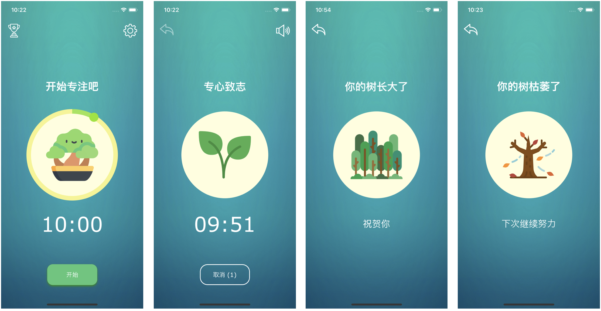
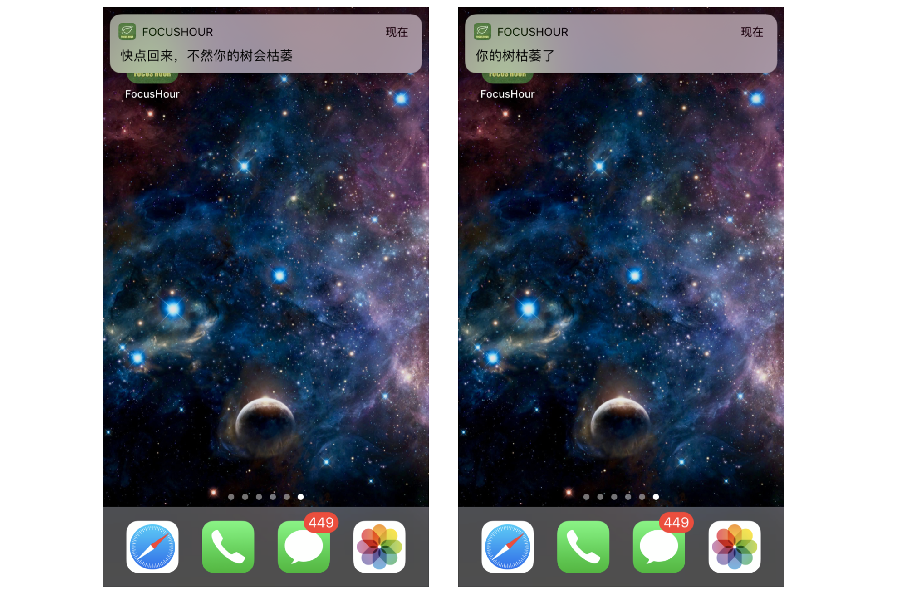
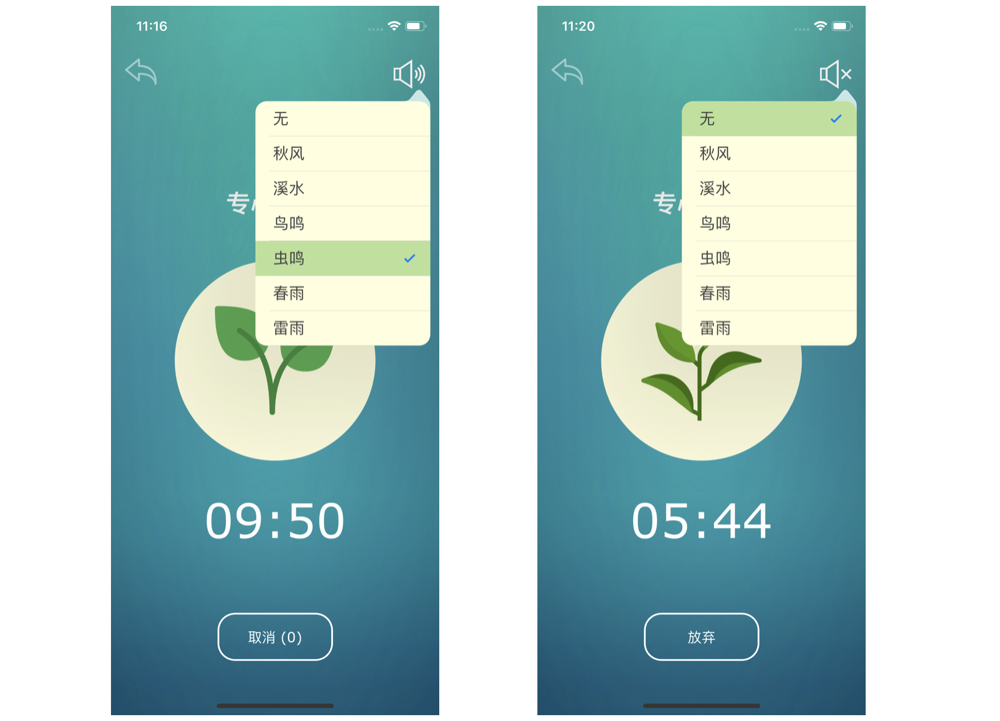
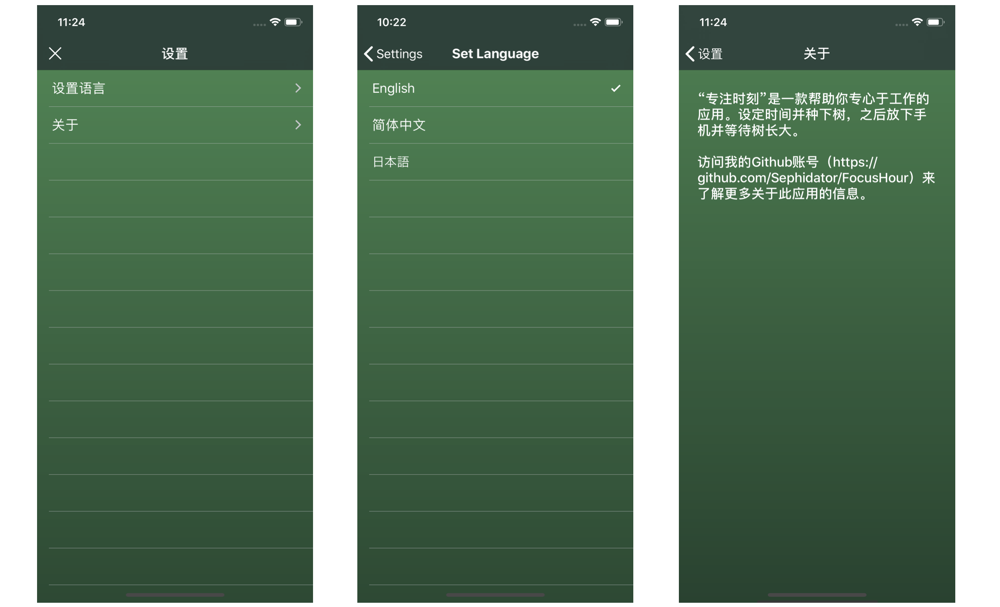
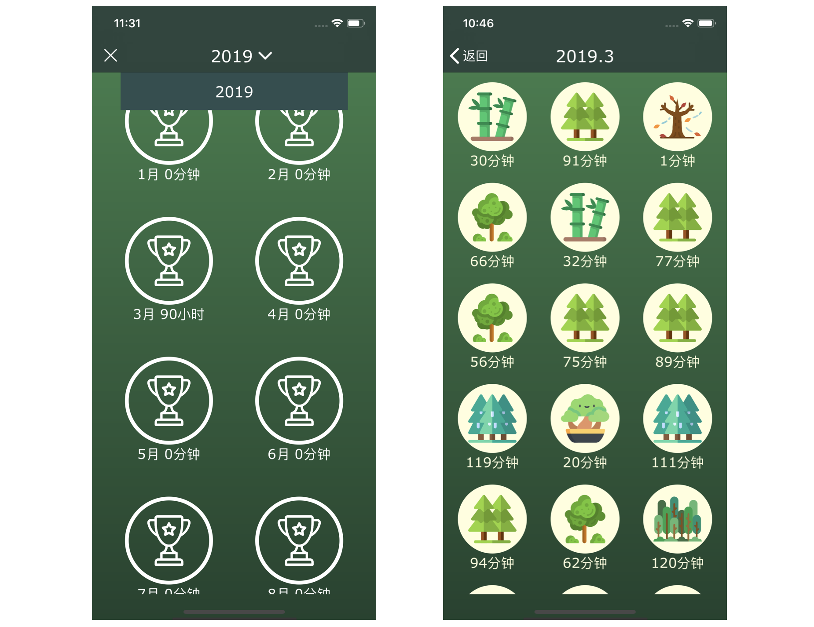

# FocusHour

一款模仿“Forest”制作的生产力应用，由Sephidator自豪地编写

在FocusHour中种下你的一棵树。

放下手机，专心于你的工作，等待树的成长。

 

 

## 简介

一款帮助你专注于自己工作的App。

支持中、英、日三种语言。

随机加载的漂亮纯色壁纸。

在App中种下一棵树，放下手机并等待其成长。

退出此应用的话你的树将枯萎。

在成就界面查看自己种下的森林吧！

 

 

## 功能介绍

因为是模仿Forest制作的，所以基本上不会有什么大的区别...

 

### 时间设置

在主屏幕设置时间后就会进入倒计时界面

在此期间放下手机，专注于自己的工作、并等待树长大

如果切换到别的应用，并且不切换回来，你的树就会枯萎

 

### 系统通知

当你退出本应用时，会收到通知提示你赶快回来

10秒内不回来的话，会收到树死亡的提示消息

 

### 背景音乐播放

在倒计时的界面，可以设置并播放背景音乐

包括虫鸣、鸟鸣、雨声、溪水等多种声音

 

### 设置

可以在设置界面热更改此应用的语言版本

支持中日英三种语言

也可以查看关于本应用的简单描述

 

### 成就界面

可以在成就界面界面查看专注的时间

点击进入某个具体的月份可以查看你种下的树

 

 

## 感谢

App icon made by <a href="https://itunes.apple.com/cn/app/logo-maker-%E5%BF%AB%E9%80%9F%E5%95%86%E6%A0%87%E5%88%B6%E4%BD%9C%E5%92%8C%E5%9B%BE%E6%A0%87%E8%AE%BE%E8%AE%A1%E5%B7%A5%E5%85%B7/id1143390028?mt=8" title="Logo Maker">Logo Maker</a>

Picture resources made by <a href="https://www.flaticon.com/packs/nature-31/3" title="Vectors Market">Vectors Market</a> from <a href="https://www.flaticon.com/"          title="Flaticon">www.flaticon.com</a> is licensed by <a href="http://creativecommons.org/licenses/by/3.0/"          title="Creative Commons BY 3.0" target="_blank">CC 3.0 BY</a>

Circle slider inspired by <a href="https://github.com/JixinZhang/ZCircleSlider/">JixinZhang</a>

